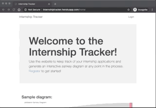

# Internship Tracker
##### By Rachit Pareek

## Overview
This application uses Jupyter Notebook, Pandas, NLTK, Scikit Learn, Matplotlib, Plotly, Flask, Bootstrap, PostgreSQL, and a variety of other technologies to help break down my internship search over the past recruiting season (for Summer 2020). I've created a web application to help others track and visualize their applications as well. The site is live for public use at `internshiptracker.herokuapp.com`.

## Demo


## Motivation
This project was an opportunity to gain some experience with Scikit and Flask while shedding light on the challenging internship recruiting process. Through my work, I gained a stronger understanding of the effectiveness of different application strategies and gained additional fluency in the libraries listed above.

## Structure 
It contains three main components:
- a Jupyter notebook
- a Sankey diagram
- a Flask app

## Jupyter Notebook
This notebook contains exploratory analysis and modeling on my internship search process. The main goal here was to use a text version of my emails to create a classifier that predicts whether a given email is career-related or not. Feel free to view it [here](./analysis.ipynb).

#### Installation & Running
Clone this repo, then navigate to the notebook after running the following commands (ideally using venv):
```Python
cd jobSearch
pip install
jupyter notebook
```

## Flask Application: Internship Tracker
This application allows users to register, input, track, & update all of their internship applications, and will generate a Sankey diagram for them using the most current data about their applications. The app is built with Flask, a variety of Flask plugins, Plotly, and PostgreSQL. It is hosted on Heroku: `internshiptracker.herokuapp.com`. 

#### Installation & Running
Clone this repo, then run the following commands (ideally using venv):
```Python
cd jobSearch
pip install
python app.py
```

Visit `localhost:5000` to see the application. 

## Sankey Diagram
The Sankey flow diagram below represents my Summer 2020 internship search.


## Improvements
- Improve the classifier.
- Allow users to reset their passwords.
