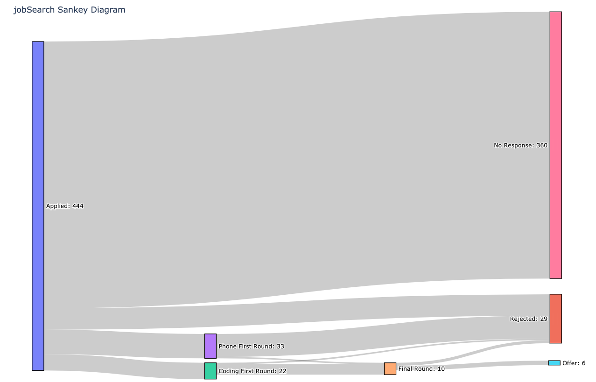

# Overview
This application uses Jupyter Notebook, Pandas, NLTK, Scikit Learn, Matplotlib, Plotly, and Flask to help break down my internship search over the past recruiting season (for Summer 2020). I've created a web application to help others track and visualize their applications as well. The site is live at `jobsearch.herokuapp.com`.

# Motivation
This project aims to understand the effectiveness of different strategies for applying to jobs (especially by looking at response rates for cold applications). Additionally, it's my first attempt at creating an email classifier using the Bag of Words method (through Scikit's CountVectorizer and a Naive Bayes model). The application first reduces the contents of emails to vectors of word counts from a general corpus (which, for the first 1231 emails was of size 17,700 after removing Scikit's default `english` stopwords.). Then, I trained a Naive Bayes model on my pre-tagged emails (1 if job-related, 0 otherwise). After classifying the emails, I created a confusion matrix (`this will soon be added below`). Finally, I filtered the emails to only those classified as job-related and manually created the Sankey diagram below (`also to be added soon`).

Need to update that^

# Structure 
It contains three main components:
- a jupyter notebook
- a sankey diagram
- a flask app

# Jupyter Notebook
discuss

# Sankey Diagram
discuss

# Flask Application
discuss



# Installation & Running
Clone this repo, then run the following commands:
```Python
cd jobSearch
pip install
flask run
```

Visit `localhost:5000` to see the application. 

# Improvements
- Improve the classifier!
